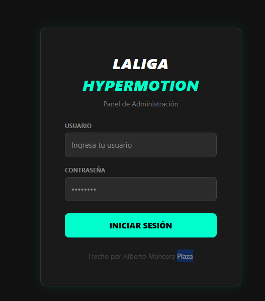
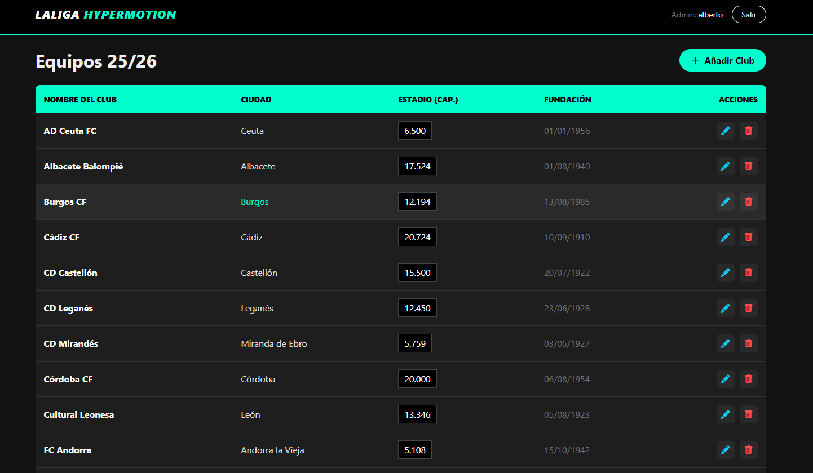
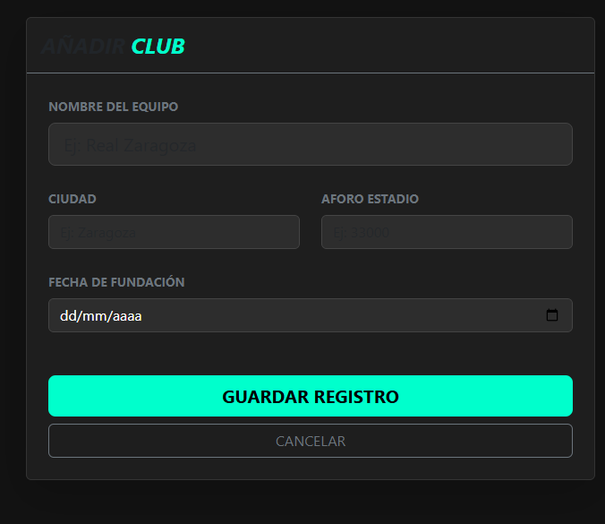

# ⚽ Panel de Gestión - LaLiga Hypermotion


Aplicación web profesional para la gestión de equipos de la **Segunda División Española 2025/26**. Desarrollada con PHP nativo bajo arquitectura **MVC**, cuenta con un sistema de autenticación seguro y una interfaz visual moderna estilo "Dark Neon" inspirada en la marca oficial.

## 🌟 Características

* **🎨 Diseño Hypermotion:** Interfaz personalizada en modo oscuro con acentos Cyan Neón (`#00ffcc`).
* **🔒 Login Seguro:** Autenticación de administradores con contraseñas encriptadas (`Bcrypt`).
* **🏗️ Arquitectura MVC:** Código limpio separado en Modelos, Vistas y Controladores.
* **⚡ CRUD Completo:**
    * **C**reate: Alta de nuevos clubes.
    * **R**ead: Listado dinámico de equipos.
    * **U**pdate: Edición de datos con precarga.
    * **D**elete: Eliminación de registros.
* **🛡️ Seguridad:** Sanitización de datos y sentencias preparadas (PDO) contra Inyecciones SQL.
* **✅ Validación:** Doble capa de validación (Frontend con JS + Backend con PHP).

## 📸 Capturas de Pantalla

| Login | Dashboard |
|:---:|:---:|
|  |  |

| Crear Equipo | Editar Equipo |
|:---:|:---:|
|  |  |

## 🛠️ Instalación y Configuración

1.  **Clonar el repositorio:**

2.  **Base de Datos:**
    * Abre tu gestor SQL (phpMyAdmin).
    * Crea una base de datos llamada `gestion_liga`.
    * Importa el script SQL incluido en la documentación o crea las tablas `usuarios` y `equipos`.

3.  **Configuración:**
    * Edita `config/Database.php` con tus credenciales:
    ```php
    private $host = 'localhost'; // o '127.0.0.1'
    private $username = 'root';
    private $password = '';
    ```

4.  **Acceso:**
    * **URL:** (http://localhost/login-php-crud/)
    * **Usuario:** `alberto`
    * **Contraseña:** `Contra123*`

## 📂 Estructura del Proyecto

```text
/
├── assets/             # JavaScript (Validaciones)
├── config/             # Conexión a Base de Datos
├── controllers/        # Controladores (Auth, Equipo)
├── models/             # Modelos (Consultas SQL)
├── views/              # Vistas HTML/PHP
│   ├── auth/           # Login
│   └── equipos/        # CRUD (Listar, Crear, Editar)
├── index.php           # Enrutador principal
└── README.md           # Documentación
